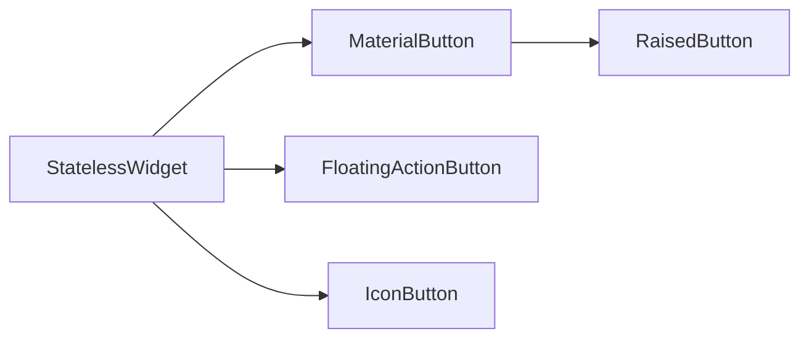
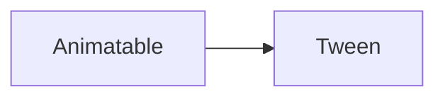

# Flutter知识点
Flutter一切皆组件
每个组件用()包括所有属性，各个属性间用,分隔，属性也可能是组件
<=表示继承了，斜体表示该方法为静态的，删除线表示该方法需要或建议被重写
[框架功能类](#class1)
[显示内容类](#class2)
[基础组件类](#class3)
[布局类](#class4)
[风格修饰类](#class5)
[常用工具类](#class6)
[动画类](#class7)

<h2 id="class1">框架功能类</h2>
框架功能类作用于最底层，往往不会被察觉其存在

### 基础方法
这些方法是自带的，不依赖于某个类

|  方法名   |    参数    | 返回 |            作用             |       示例       | 备注 |
| -------- | ---------- | ---- | --------------------------- | ---------------- | ---- |
| runApp() | Widget app | \    | 一般存在于main方法用于打开APP | runApp(MyApp()); | \    |
### BuildContext
Flutter的每个组件都有一个BuildContext，一般名为context
Flutter每个组件的context是他们在组件树中的句柄
下面所有类的方法中的BuildContext context简化为BC
### FadeTransition
|  参数名  |                 作用                  | 参数使用的类 |       示例值       |
| ------- | ------------------------------------ | ----------- | ----------------- |
| opacity | 定义过渡效果的透明度                   | Tween       | Tween().animate() |
| child   | 定义过渡结束时的页面，一般从方法参数获得 | Widget      | child             |
### Scaffold
Scaffold实现了最基本的页面

|            参数名             |             作用             |                参数使用的类                |                   示例值                   |
| ---------------------------- | --------------------------- | ----------------------------------------- | ----------------------------------------- |
| appBar                       | 顶部显示一个AppBar           | AppBar( PreferredSizeWidget)              | AppBar()                                  |
| body                         | 定义内部的内容                | Widget                                    | Center()                                  |
| bottomNavigationBar          | 定义底部的内容(导航栏）       | BottomNavigationBar、BottomAppBar<=Widget | BottomNavigationBar()                     |
| floatingActionButton         | 定义一个悬浮按钮，默认在右下角 | FloatingActionButton                      | FloatingActionButton()                    |
| floatingActionButtonLocation | 定义悬浮按钮的位置            | FloatingActionButtonLocation              | FloatingActionButtonLocation.centerDocked |

| 方法名 |           参数           |     返回      |                作用                 |     示例     |          备注           |
| ------ | ------------------------ | ------------- | ----------------------------------- | ------------ | ---------------------- |
| *.of*  | BC, {bool nullOk: false} | ScaffoldState | 通过context找到最近的的ScaffoldState | .of(context) | nullOK表示未找到返回null |
### ScaffoldState
ScaffoldState记录着Scaffold的状态，也可以用来产生SnackBar和BottomSheets等

|     方法名     |       参数        |                           返回                            |               作用                |           示例            |         备注          |
| ------------- | ----------------- | --------------------------------------------------------- | --------------------------------- | ------------------------- | -------------------- |
| .showSnackBar | SnackBar snackbar | ScaffoldFeatureController<SnackBar, SnackBarClosedReason> | 在指定的Scaffold处生成一个SnackBar | .showSnackBar(SnackBar()) | 返回值一般不用特别注意 |
### State<?>
用来定义一个可改变的组件其内部状态，一般用来被继承，如`_XXXState<=State<XXX>`

|   方法/属性名   |     参数      |  返回  |              作用               |                 示例                  |      备注       |
| -------------- | ------------- | ------ | ------------------------------- | ------------------------------------- | --------------- |
| ~~.build~~     | BC            | Widget | 定义该组件的内容                 | \                                     | \               |
| ~~.initState~~ | \             | void   | 可变组件初始化时自动调用的方法     | `{super.initState();}`                | 注意父类的初始化 |
| .setState      | 无返回无参方法 | \      | 改变组件的状态属性，使组件发生变化 | `.setState((){_currentState=index;})` | \               |
| widget         | \             | \      | 指向该State对应的StatefulWidget  | widget._title                         | 示例调用了其属性 |
### StatefulWidget
从StatefulWidget派生出的Widget其状态是可变的，其状态被改变后会使得手机上的显示发生改变
如果XXX<=StatefulWidget则需要再定义一个类，一般名为`_XXXState<=State<XXX>`，主要代码也在_XXXState里编写

|      方法名       | 参数 |   返回    |        作用         |                示例                 |       备注       |
| ---------------- | ---- | --------- | ------------------ | ----------------------------------- | ---------------- |
| ~~.createState~~ | 无BC | _XXXState | 定义该组件状态可改变 | `=> _BottomNavigationWidgetState()` | State才是更重要的 |
### StatelessWidget
从StatelessWidget派生出的Widget其状态是不可变的，手机上其状态是固定的，但是其子Widget可以是Stateful的

|   方法名    | 参数 |  返回  |      作用       | 示例 | 备注 |
| ---------- | ---- | ------ | --------------- | ---- | ---- |
| ~~.build~~ | BC   | Widget | 定义该组件的内容 | \    | \    |
### MaterialApp
表示该页面封装了Material Design所需要的一些Widget，简而言之就是底层部件

| 参数名 |              作用               | 参数使用的类 |                示例值                |
| ------ | ------------------------------ | ----------- | ------------------------------------ |
| title | 定义该App的标题，应用切换时会显示 | String      | `"标题"`                             |
| home   | 定义该页面的首页                 | Widget      | FirstPage() —— 继承自StatelessWidget |
| theme | 定义页面的主要风格               | ThemeData   | ThemeData()                         |
### MaterialPageRoute
继承自PageRoute的一个路由，用于定义切换到什么页面以及管理切换的效果

|  参数名  |           作用           |                参数使用的类                |          示例值          |
| ------- | ------------------------ | ----------------------------------------- | ----------------------- |
| builder | 定义跳转到新页面以及其方法 | 一个返回Widget ，以BuildContext为参数的方法 | (context)=>SecondPage() |
### Navigator
Navigator为App内各个页面之间跳转的管理器，实际上就是一个栈

|            方法名            |         参数         |      返回      |              作用               |                      示例                       |                           备注                            |
| --------------------------- | -------------------- | -------------- | ------------------------------- | ----------------------------------------------- | --------------------------------------------------------- |
| *`.push<T extends Object>`* | `BC, Route<T> route` | `Future<T>`    | 将一个路由压入栈                 | .push(context, MaterialPageRoute())             | 在push方法前加await可以返回pop时的传参，其中T为传参的参数类型 |
| *`.pop<T extends Object>`*  | (BC, [T result])     | bool           | 弹出顶端路由                     | .pop(context,"名字是Flutter");                   | T为传参的参数类型，也可以不传参，传参时push前面要加await      |
| *.of*                       | BC                   | NavigatorState | 获取context，push和pop时无需传BC | Navigator.of(context).push(MaterialPageRoute()) | 不用特意使用                                               |
### PageRouteBuilder
用来自定义Route的类，可以自定义动画效果等

|       参数名        |            作用            |                              参数使用的类                              |                                                            示例值                                                            |
| ------------------ | ------------------------- | --------------------------------------------------------------------- | --------------------------------------------------------------------------------------------------------------------------- |
| transitionDuration | 定义跳转过渡效果时间        | Duration                                                              | Duration()                                                                                                                  |
| pageBuilder        | 定义跳转到什么页面、如何跳转 | 以BC和两个`Animation<double>`为参数，返回Widget的方法，该Widget为页面内容 | (BuildContext context,Animation<double> animation1, Animation<double> animation2, ){return widget;},                        |
| transitionsBuilder | 定义跳转的过渡效果          | 参数同上且多一个Widget，返回一个FadeTransition                           | (BuildContext context,Animation<double> animation1, Animation<double> animation2, Widget widget){return FadeTransition();}, |

<h2 id="class2">显示内容类</h2>
显示内容类是用来加载实际内容的，可能是图片、文字等
特点是这些内容直接来自外部或程序内部自带

### Icon
生成一个图标，常和Icons类一起使用

| 参数名 |            作用             | 参数使用的类  |     示例值     |
| ------ | -------------------------- | ------------ | ------------- |
| 图源   | 用来定义Icon的图标          | Icons        | Icons.ac_unit |
| color  | 用来定义Icon的颜色，默认灰色 | Color/Colors | Colors.blue   |
### Image
Image用来显示图片
Image有两个通道，dst和src，dst为目标图像通道，src为源图像通道，src默认比dst优先级高
四种加载图片的方式
**第一种为Image.asset(file)**
从APP的资源，即从项目目录加载图片，打包
**第二种为Image.file(file)**
从手机存储，即本地路径加载图片
**第三种为Image.memory(file)**
从内存加载图片（不准确）
**第四种为Image.network(file)**
从网络加载图片，用得较多
#### Image.network()
|     参数名      |                                         作用                                         | 参数使用的类  |        示例值         |
| -------------- | ------------------------------------------------------------------------------------ | ------------ | -------------------- |
| 路径           | 用路径加载的图片为dst通道！！！！ 直接填入路径，其他属性跟在路径后                         | String       | "https://dsda.jpg"   |
| fit            | fit决定图片在容器中如何显示                                                            | BoxFit       | BoxFit.contain       |
| color          | color将设置src通道内容                                                                | Color/Colors | Colors.red           |
| repeat         | 设置图像的重复方式                                                                     | ImageRepeat  | ImageRepeat.noRepeat |
| colorBlendMode | 图像混合模式，将dst通道和src通道以某种规则混合，见https://www.jianshu.com/p/4fb8f1a08d12 | BlendMode    | BlendMode.lighten    |
#### Image.asset()

| 参数名 |                    作用                    | 参数使用的类 |       示例值        |
| ----- | ----------------------------------------- | ----------- | ------------------- |
| 路径   | 用路径加载的图片为dst通道，路径需要先进行陪住 | String      | "images/img005.jpg" |
### NetworkImage类
NetworkImage类<=ImageProvider类

| 参数名 |        作用         | 参数使用的类 |      示例值       |
| ------ | ------------------ | ----------- | ---------------- |
| 图源   | 用网络地址加载的图片 | String      | https://dsda.jpg |
### Text
用来显示普通文本
第一行为文本内容，只能有一个文本
默认单词换行

|   参数名  |                      作用                      | 参数使用的类  |         示例值         |
| --------- | ---------------------------------------------- | ------------ | --------------------- |
| 文本      | 需要显示的文本内容，只能有一个字符串              | String       | "wdnmd"               |
| textAlign | 显示文字的水平对齐方式，默认TextAlign.left        | TextAlign    | TextAlign.center      |
| maxLines  | 决定文字在组件内显示的最大行数，默认无             | int          | 1                     |
| overflow  | 决定多余的文字如何进行显示，默认TextOverflow.clip | TextOverflow | TextOverflow.ellipsis |
| style     | 决定文字的样式                                  | TextStyle    | TextStyle()           |

-------------------
-------------------
<h2 id="class3">基础组件类</h2>

[Bar类](#Bar)
[元素类](#Item)
[按钮类](#Button)
[容器类](#Container)

Flutter有大量自带组件，和html里`<ol>`  `<button>`等标签相似
特点是其child通常只有一个，用来包裹显示内容类

<h3 id="Bar">Bar类</h3>

#####  AppBar
用于在页面顶端生成一个头

|      参数名      |         作用          | 参数使用的类  |   示例值    |
| --------------- | --------------------- | ------------ | ---------- |
| title           | 定义Bar的首标题        | Text         | Text()     |
| leading         | 放置Bar图标           | Icon<=Widget | Conainer() |
| backgroundColor | 定义AppBar颜色        | Color/Colors | Color.red  |
| elevation       | 定义AppBar底部阴影大小 | double       | 4.0        |
##### SnackBar
在底部加载一个小弹窗，一段时间后自动消失

|  参数名  |         作用          | 参数使用的类 | 示例值  |
| ------- | --------------------- | ----------- | ------ |
| content | 定义SnackBar弹出的内容 | Text        | Text() |
##### BottomAppBar
更加自由的底部导航栏

| 参数名 |             作用              |               参数使用的类               |           示例值            |
| ----- | ---------------------------- | --------------------------------------- | -------------------------- |
| color | 定义背景颜色                   | Color/Colors                            | Colors.lightBlue           |
| shape | 定义浮动图标叠加在Bar上时的效果 | CircularNotchedRectangle<= NotchedShape | CircularNotchedRectangle() |
| child | 定义其元素内容                 | Row<=Widget                             | Row                        |
##### BottomNavigationBar
用于生成一个导航栏（常放在底部

|        参数名        |                   作用                    |         参数使用的类         |                         示例值                         |
| -------------------- | ---------------------------------------- | --------------------------- | ----------------------------------------------------- |
| item                 | 定义Bar的几个导航元素                      | BottomNavigationBarItem数组 | [BottomNavigationBarItem(),BottomNavigationBarItem()] |
| showUnselectedLabels | 定义是否显示未选择导航元素的title           | bool                        | true                                                  |
| showSelectedLabels   | 定义是否显示选择的导航元素的title           | bool                        | false                                                 |
| currentIndex         | 设置哪个导航元素被选中                     | int                         | _currentState                                         |
| onTap                | 设置item被点击时的事件，其位置作为参数被使用 | 有一个int参数无返回的方法     | (int index){setState()                               }       |

-------------------
<h3 id="Item">元素类</h3>

##### BottomNavigationBarItem
底部导航栏导航元素

| 参数名 |   作用    | 参数使用的类 |      示例值       |
| ----- | --------- | ----------- | ---------------- |
| icon  | 定义其图标 | Icon        | Icon(Icons.home) |
| title  | 定义其标题 | Text        | Text()           |

##### Divider
产生一个分割线

|   参数名  |                                       作用                                        | 参数使用的类  |    示例值    |
| --------- | -------------------------------------------------------------------------------- | ------------ | ----------- |
| color     | 用来定义分割线的颜色                                                               | Color/Colors | Colors.blue |
| thickness | 定义分割线粗细，thickness增大时，会向上增粗，过大时会遮蔽上方元素，而分割线所占空间不变 | double       | 3.0         |
| height    | 定义分割线所占空间高度，height增大时，其上边空白增加                                 | double       | 3.0         |
##### Expanded
Expanded类使Row、Column、Flex等子组件在其主轴方向上展开并填充可用空间

| 参数名 |             作用             | 参数使用的类 |     示例值      |
| ------ | ---------------------------- | ----------- | -------------- |
| child  | 子组件，使其能自动充满整个空间 | Widget      | RaisedButton() |
##### ListTile
ListTile组件生成一个列表单元

|  参数名  |     作用      |    参数使用的类    |          示例值           |
| ------- | ------------- | ----------------- | ------------------------ |
| leading | 通常存放图标   | Icon/CircleAvatar | Icon(Icons.access_time ) |
| title   | 通常存放主标题 | Text              | Text()                   |
-------------------
<h3 id="Button">按钮类</h3>

##### MaterialButton
按钮类，创造一个按钮

|   参数名  |               作用                |       参数使用的类        |    示例值    |
| --------- | -------------------------------- | ------------------------ | ----------- |
| onPressed | 用来定义RaisedButton被点击时的事件 | 一个没有参数，无返回的方法 | `(){}  `    |
| color     | 用来定义RaisedButton背景颜色       | Color/Colors             | Colors.blue |
| child     | 用来显示RaisedButton里的内容       | Widget                   | Text()      |
##### IconButton
IconButton是一个图标按钮

|   参数名   |    作用     |  参数使用的类  |          示例值           |
| --------- | ----------- | ------------- | ------------------------ |
| icon      | 存放图标     | Icon          | Icon(Icons.access_time ) |
| onPressed | 点击响应事件 | 无参无返回方法 | (){}                     |
##### FloatingActionButton
FloatingActionButton是一个浮动按钮，通常为圆形

|   参数名  |             作用              |       参数使用的类        |   示例值   |
| --------- | ----------------------------- | ------------------------ | --------- |
| onPressed | 用来定义按钮被点击时的事件      | 一个没有参数，无返回的方法 | `(){}  `  |
| tooltip   | 用来定义长按按钮时显示的提示信息 | String                   | "Flutter" |
| child     | 用来显示按钮里的内容            | Widget                   | Icon()    |

-------------------
<h3 id="Container">容器类</h3>

##### Card
在子元素周围添加一层类似于卡片的效果

| 参数名 |            作用             | 参数使用的类 | 示例值  |
| ------ | --------------------------- | ----------- | ------ |
| child  | 用来显示RaisedButton里的内容 | Widget      | Text() |
##### CircleAvatar
CircleAvatar类可以生成带有弧度容器

|      参数名      |                    作用                    |         参数使用的类         |               示例值                |
| --------------- | ------------------------------------------ | --------------------------- | ---------------------------------- |
| backgroundImage | 用来显示CircleAvatar里的背景图片            | NetworkImage<=ImageProvider | NetworkImage("https://dsda.jpg"  ) |
| radius          | 用来定义容器四个角的弧度，100时为最大，呈圆形 | double                      | 100.0                              |
##### Container
和html里的div相似

|   参数名    |             作用              |  参数使用的类  |             示例值              |
| ---------- | ----------------------------- | ------------- | ------------------------------ |
| alignment  | 设置内部内容的水平和垂直对齐方式 | Alignment     | Alignment.center               |
| width      | 设置宽度                       | double        | 200.0                          |
| height     | 设置高度                       | double        | 200.0                          |
| color      | 设置背景颜色                   | Color/Colors  | Colors.green                   |
| padding    | 设置内边距                     | EdgeInsets    | const EdgeInsets.all(allvalue) |
| margin     | 设置外边距                     | EdgeInsets    | const EdgeInsets.all(allvalue) |
| decoration | 设置容器装饰                   | BoxDecoration | BoxDecoration()                |
---------------
---------------
<h2 id="class4">布局类</h2>
布局类是设计总体布局的类
特点是其child有时不止一个，会包裹许多基础组件类
###  GridView
GridView实现网格布局

|    参数名     |            作用            |                                    参数使用的类                                     |                       示例值                       |
| ------------ | ------------------------- | ---------------------------------------------------------------------------------- | ------------------------------------------------- |
| gridDelegate | 网格委托，使用委托生成表格？ | SliverGridDelegateWithFixedCrossAxisCount/SliverGridDelegateWithMaxCrossAxisExtent | SliverGridDelegateWithFixedCrossAxisCount()       |
| children     | 定义GridView内容           | Widget数组                                                                         | `<Widget>[Container(),Container(),Container()]  ` |

#### GridView.count()
较为简单的一种写法

|      参数名       |        作用         | 参数使用的类 |                       示例值                       |
| ---------------- | ------------------- | ----------- | ------------------------------------------------- |
| padding          | GridView和子元素间距 | EdgeInsets  | EdgeInsets.all(allvalue)                          |
| crossAxisSpacing | 网格元素之间的间距    | double      | 10.0                                              |
| crossAxisCount   | 每行的列数           | int         | 3                                                 |
| children         | 定义GridView内容    | Widget数组  | `<Widget>[Container(),Container(),Container()]  ` |
### ListView
ListView组件默认生成一个纵向列表

|      参数名      |          作用           | 参数使用的类 |                       示例值                        |
| --------------- | ----------------------- | ----------- | -------------------------------------------------- |
| children        | 用来定义ListView内的内容 | Widget数组  | ` <Widget>[Container(),Container(),Container()]  ` |
| scrollDirection | 设置列表方向             | Axis        | Axis.horizontal                                    |
#### ListView.builder()
|    参数名    |          作用           |                                      参数使用的类                                      |                                  示例值                                  |
| ----------- | ----------------------- | ------------------------------------------------------------------------------------- | ----------------------------------------------------------------------- |
| itemBuilder | 用来定义ListView内的内容 | 返回Widget（可能），含有context和index两个参数的方法,index将会从0开始到itemCount-1为止遍历 | `(context,index){return new ListTile( title:Text('${items[index]}') );` |
| itemCount   | 定义item数量            | int                                                                                   | 20                                                                      |

### Row
Row类使其子元素都放置在同一行内

|       参数名        |             作用              |    参数使用的类     |                       示例值                        |
| ------------------ | ---------------------------- | ------------------ | -------------------------------------------------- |
| children           | 用来定义Row内的内容            | Widget数组         | ` <Widget>[Container(),Container(),Container()]  ` |
| crossAxisAlignment | 用来定义Row内垂直对齐方式      | CrossAxisAlignment | CrossAxisAlignment.start                           |
| mainAxisAlignment  | 用来定义Row内水平对齐方式      | MainAxisAlignment  | MainAxisAlignment.end                              |
| mainAxisSize       | 定义Row中横向上有多少空白被占据 | MainAxisSize       | MainAxisSize.max                                   |
### Stack
Stack类可以使几个子元素叠加在一起

|   参数名  |                              作用                              | 参数使用的类 |                       示例值                        |
| --------- | ------------------------------------------------------------- | ----------- | -------------------------------------------------- |
| children  | 用来定义Stack内的内容，其中组件越在前，显示时越在下               | Widget数组  | ` <Widget>[Container(),Container(),Container()]  ` |
| alignment | 用来定义children中第二个及其之后的组件相对于第一个组件如何对齐放置 | Alignment   | FractionalOffset(0.5, 0.8)                         |
<h2 id="class5">风格修饰类</h2>
风格修饰类常对其他类进行样式的细化

### BoxDecoration
设置容器装饰

|   参数名  |        作用         |  参数使用的类   |      示例值       |
| -------- | ------------------ | -------------- | ---------------- |
| gradient | 设置变化效果        | LinearGradient | LinearGradient() |
| border   | 设置容器边框，默认无 | Border         | Border.all()     |
### Border
设置边框的样式

| 参数名 |    作用     | 参数使用的类  |   示例值    |
| ----- | ----------- | ------------ | ---------- |
| width | 设置边框宽度 | double       | 2.0        |
| color | 设置边框颜色 | Color/Colors | Colors.red |
### LinearGradient
设置线性变化样式

| 参数名  |             作用             |   参数使用的类    |                         示例值                          |
| ------ | --------------------------- | ---------------- | ------------------------------------------------------ |
| colors | 设置线性变化效果，默认从左到右 | Color/Colors数组 | [Colors.lightBlue,Colors.lightGreenAccent,Colors.pink] |
### TextStyle
TextStyle 设置文字样式

|      参数名      |         作用         |     参数使用的类     |           示例值           |
| --------------- | ------------------- | ------------------- | ------------------------- |
| fontSize        | 决定文字大小，默认14  | double              | 23.0                      |
| color           | 决定文字颜色 默认黑色 | Color/Colors        | Color.fromARGB(a,r,g,b)   |
| decoration      | 给文字添加装饰 默认无 | TextDecoration      | TextDecoration.underline  |
| decorationStyle | 设置装饰样式         | TextDecorationStyle | TextDecorationStyle.solid |
| fontWeight      | 决定文字粗细         | FontWeight          | FontWeight.w500           |

###  SliverGridDelegateWithFixedCrossAxisCount
定义生成网格的方法、样式等

|      参数名       |        作用        | 参数使用的类 | 示例值 |
| ---------------- | ----------------- | ----------- | ----- |
| crossAxisCount   | 每行的列数         | int         | 3     |
| mainAxisSpacing  | 每行间的间隔       | double      | 2.0   |
| crossAxisSpacing | 每列的间隔         | double      | 2.0   |
| childAspectRatio | 每个格子的宽:长比值 | double      | 0.75  |

<h2 id="class6">常用工具类</h2>
这些工具类通常用来为其他类进行属性赋值
并且自身往往不需要其他类作为参数

##### Alignment类
设置容器内部水平、垂直对齐方式
Alignment.center 设置为水平垂直居中
Alignment.centerLeft 设置为垂直居中，水平向左
Alignment.centerRight 设置为垂直居中，水平向右
Alignment.bottomCenter 设置为底部居中对齐
Alignment.topCenter 设置为顶部居中对齐
使用构造函数时：
Alignment(0,0)表示放在中间

|         |        |        |
| ------- | ------ | ------ |
| (-1,-1) | (0,-1) | (1,-1) |
| (-1,0)  | (0,0)  | (1,0)  |
| (-1,1)  | (0,1)  | (1,1)  |
##### Axis类
设置列表的方向
Axis.horizontal 设置列表方向为横向
Axis.vertical 默认值，设置列表方向为纵向
##### BlendMode类
图像混合模式，更多模式见https://www.jianshu.com/p/4fb8f1a08d12
如BlendMode.lighten
##### BoxFit类
图片在容器中如何显示
BoxFit.contain 图片等比例缩放，直至其宽或高与容器宽或高相同（适应
BoxFit.fill 图片缩放，直至其宽或高与容器宽或高相同（填满
BoxFit.cover 图片等比例缩放，直至其宽或高都大于等于容器宽或高，多余部分将被裁切（平铺满
BoxFit.fitHeight 图片等比例缩放，直至其高等于容器高，多余部分将被裁切（高度满
BoxFit.fitWidth 图片等比例缩放，直至其宽等于容器宽，多余部分将被裁切（宽度满
BoxFit.none 图片按原分辨率展示，多余的将被裁切
BoxFit.scaleDown 图片不能被放大，但能被缩小显示，其余和contain相同
##### Color类/Colors类
设置颜色，Colors类为自带的一些颜色，Color类为使用方法设置颜色
Color.fromARGB(a,r,g,b)设置颜色 注意a透明度在第一个
##### CrossAxisAlignment类
设置Row、Column内子元素副轴的对齐方式（Row的副轴是垂直方向
##### EdgeInsets类
用来插入padding,margin
EdgeInsets.all(values）四周相同
EdgeInsets.fromLTRB(left,top,right,botton) 四周不同
##### FloatingActionButtonLocation类
设置FloatingActionButton的位置
FloatingActionButtonLocation.centerDocked 设置按钮在底部中间并且可以嵌入
FloatingActionButtonLocation.centerDocked 设置按钮在底部中间并且但不嵌入
##### FontWeight类
用来设置文字的粗细
FontWeight.w500
##### FractionalOffset类
FractionalOffset类<=Alignment类

|         |         |
| ------- | ------- |
| （0,0） | （1,0） |
| （0,1） | （1,1） |
##### Icons类
存放一些内置的图标
如Icons.access_time，使用时需要new一个Icon
##### ImageRepeat类
设置图像的重复方式
ImageRepeat.repeat 从正中央开始向四周重复
ImageRepeat.noRepeat 不重复，默认值
ImageRepeat.repeatX 从水平居中向左右横向重复
ImageRepeat.repeatY 从垂直居中向上下纵向重复
##### MainAxisAlignment类
设置Row、Column内子元素主轴的对齐方式（Row的主轴是水平方向
##### MainAxisSize类
设置Row、Column内子元素主轴上有多少空白被占据
##### TextAlign类
设置文本对齐方式
TextAlign.center  居中对齐
TextAlign.left 左端对齐
TextAlign.right 右端对齐
TextAlign.start 文字开始处对齐
TextAlign.left 文字结束处对齐（以上两种可能考虑到不同语言的阅读方向习惯，中英文和left right无太大区别）
##### TextDecoration类
设置文本装饰
TextDecoration.underline 添加下划线  
##### TextDecorationStyle类
设置文本装饰样式
TextDecorationStyle.solid 设置下划线为单实线
##### TextOverflow类
设置文本溢出时的样式
TextOverflow.clip 不显示多余文字
TextOverflow.ellipsis 在末尾添加...
TextOverflow.fade 在末尾整一行添加从上到下的由深至浅的渐变效果，但看不太出来
##### ThemeData类
设置页面的主要风格
ThemeData.light() 设置风格为亮色

<h2 id="class7">动画类</h2>

### Animatable
有动画效果的组件

|  方法名   |                 参数                  |      返回      |   作用   |            示例             |   备注    |
| -------- | ------------------------------------- | -------------- | ------- | --------------------------- | --------- |
| .animate | ` CurvedAnimation<=Animation<double>` | `Animation<T>` | 生成动画 | .animate(CurvedAnimation()) | 不关注返回 |
### Tween
透明度动画效果组件

| 参数名 |    作用     | 参数使用的类 | 示例值 |
| ----- | ----------- | ----------- | ----- |
| begin | 开始的透明度 | double      | 0.0    |
| end   | 结束的透明度 | double      | 1.0   |
### Animation
动画组件，默认为`Animation<double>`

| 参数名  |        作用         |     参数使用的类     |        示例值         |
| ------ | ------------------ | ------------------- | -------------------- |
| parent | 此动画应用曲线的动画 | `Animation<double>` | animation1           |
| curve  | 动画曲线            | Curve/Curves        | Curves.fastOutSlowIn |