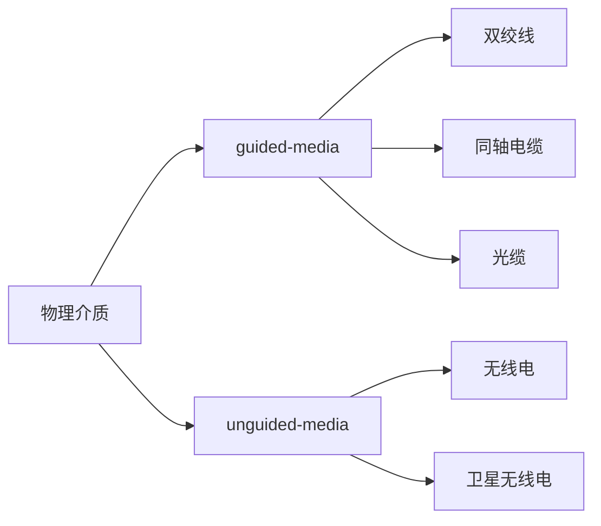

# 第一章
### 网络架构
网络边缘——主机（端系统，包括服务器、一般电脑）
接入网、物理介质——用户使用有线无线接入的网络
网络核心——互联的路由
##### 网络边缘
客户机/服务器模式 服务器一直开机等待信息
端到端（p2p）模式 很少使用服务器，如BT、网络电话
##### 接入网，物理介质
端系统和边缘路由连接类型：住宅、机构、移动等接入网络（不重要
需要了解接入网的带宽、共享或专用
**连接方式**
拨号连接(modem将数字信号转换成模拟信号，通过电话线传输）
数字用户线DSL，宽带接入（一条电话线频分复用，分成下载、上传、电话三条信道）
有源/无源光网络，光纤接入（电信OLT终端和用户ONT单元，使用光信号
局域网，公司、组织接入（以太网，速率很快
无线接入（无限局域网（WIFI使用AP）/广域无线接入（3G4G使用基站）
线缆网络，有线电视接入（多个用户共享一个接入
**物理介质**

双绞线（最大100米，四对绝缘线，常见）
同轴电缆（有线电视，老电视背后那种，双向）
光缆（不受干扰、传输远，衰减少）
无线电（无线，衰减大
卫星无线电（使用卫星传输数据，延迟200ms以上
##### 网络核心
是路由器构成的网络
**数据在网络里交换的方式**
电路交换（独占一条链路，直接从起始路由到达终点路由
报文交换（先到相邻结点，存储转发到下一个节点——减少等待
分组交换（每个报文分成相同大小的分组，到达相邻结点后不等待其他分组，存储转发到下一个节点——大小文件间公平
**网络的网络**
ISP：互联网服务提供商
第一层ISP：国家的ISP，一个国家或多个国家构成一个ISP，各个ISP间相互连接
第二层ISP：地区，大企业的ISP，和第一层ISP连接，也可以和其他第二层ISP连接，两者的通信可以不经过第一层
第三层ISP：和用户相连的本地ISP，也和第二层ISP相连，用户的数据通过多层ISP连接其他ISP
### 延迟、丢包、吞吐率
##### 延迟 
处理延迟：路由对收到的数据进行处理的延迟（决定输出链路，进行分组
排队延迟：数据到达路由，但发生了堵塞，需要进入缓冲区排队（取决于堵塞程度
传输延迟：缓冲区的数据发送到链路上的延迟（带宽越大，传输越快
传播延迟：数据在链路上传输的延迟
##### 丢包
路由的缓冲区已满，之后到达的数据包将会被丢掉
##### 吞吐率
在传输链路上最小的传输速率为该链路的吞吐率
### 协议层次
Internet协议栈
##### 应用层
支持网络应用
FTP,SMTP,HTTP
应用里实现
##### 传输层
process-process数据传输
TCP,UDP
操作系统里实现
##### 网络层
从源到目的地路由数据包
IP,routing protocols
操作系统里实现
##### 链路层
相邻两个网络设备之间传输数据
PPP,Ethernet
网卡里实现
##### 物理层
bits "on the wire"
线路上实现

端系统在应用层上工作，交换机在链路层上工作，路由在网络层上工作