# LoneMusic说明
## 一、音乐的数据
**云端部分**
1、音乐的上传一般在电脑上完成，直接上传到Music数据库的MusicList数据表
2、MusicList数据表的字段：

|         ID         |  MusicName  | Artist |  Data   | 
| ------------------ | ----------- | ------ | ------- | 
| 歌曲ID，自增长，主键 | 歌曲名，唯一 | 歌手名  | 歌曲数据 |

3、电脑上传音乐需要有 MusicName 、Artist 、Data三个数据，一般会自动解析mp3里的文件进行上传，MyFavouriteMusic，other可以在音乐第一次上传时进行初始设定
4、手机上新增的歌单只在手机上的other上保存，服务器只存数据不存歌单
**手机端部分**
1、除了新增音乐，所有数据都将以手机端为准，数据放在Music数据库的MusicList数据表
2、MusicList数据表的字段：

|     ID      | MusicName | Artist |          Path          |       Times       |  MyFavouriteMusic  |     other..     |
| ----------- | --------- | ------ | ---------------------- | ----------------- | ------------------ | --------------- |
| 歌曲ID，主键 | 歌曲名     | 歌手名  | 歌曲存放路径，默认"null" | 音乐播放次数，默认0 | 我喜欢的List，默认1 | 其他List ，默认0 |
3、务必保证手机有网络，否则将直接退出，如果有网络但无法联网将导致数据不协调（尤其是不要进行有关歌单的操作，只能进行播放
## 二、APP逻辑代码记录
#### eventbus
**eventbus.dart-Player**
1、audioPlayer：静态的播放器，所有播放音乐通过它调用
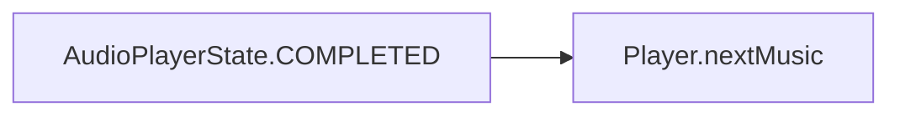
2、playMusic()
播放publicMusicMessage里的歌曲
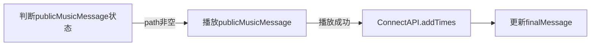
3、pauserMusic()
暂停音乐播放
4、nextMusic()
播放下一首
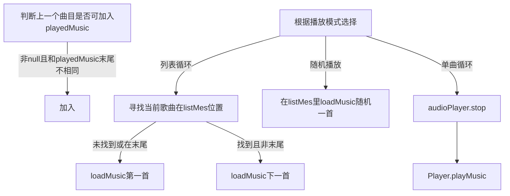
5、preMusic()
播放前一首
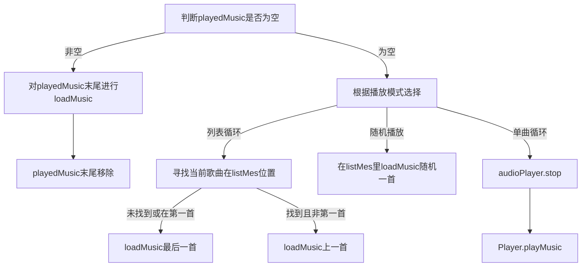
6、loadMusic(List musicMessage)
预加载音乐
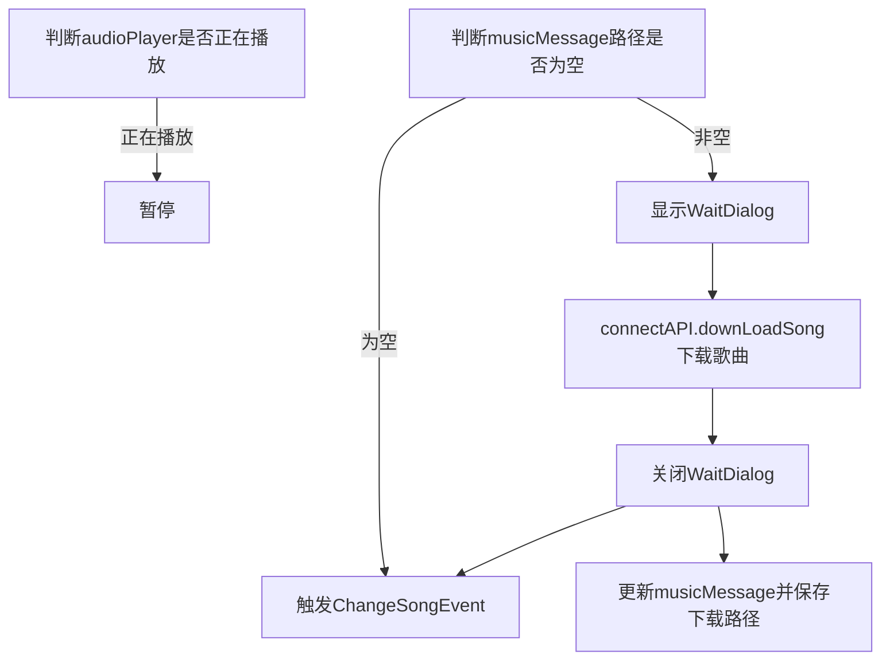
**eventbus.dart-publicData**
1、static MaterialLocalizations materialLocalizations;//用于wait_dialog的生成，是本地化类
2、static GlobalKey<NavigatorState> navigatorKey=GlobalKey();//用于页面的压入，弹出
3、static List<String> publicMusicMessage;
当前（或即将）播放歌曲的信息
ID,MUSICNAME,ARTIST,PATH
4、static List<List<String>> playedMusic=new List();
本次运行的播放历史，不持续化保存，用来进行preMusic
5、static List<List<String>> listMes=new List();
打开的歌单内歌曲信息
6、static String finalPlaymode
播放模式信息
7、static String finalListName;
歌单名
8、init()
一些在MainPage打开前必须不为null的属性需要被初始化，更多时候是用来加载最后运行的信息
检查finalPlaymode是否为null，是的话初始化为"列表循环"并存储
检查finalListName是否为null，是的话初始化为"null"并存储
检查publicMusicMessag是否为null，是的话初始化为["null","null","null","null"]并存储
9、changePlaymode()
根据当前播放模式切换到下一种播放模式并存储
**eventbus.dart-ChangeSongEvent**
当歌曲发生改变时触发
在构造方法里更新publicMusicMessage，并播放音乐
**eventbus.dart-AddSingListEvent**
添加歌单时触发
**eventbus.dart-DelSingListEvent**
删除歌单时触发
调用ConnectAPI.connectAPI.deleteSongListForShared和ConnectAPI.connectAPI.deleteSongListForDataBase
**eventbus.dart-DelSingEvent**
删除歌单内歌曲时触发
在构造方法里查找删除的歌曲在playedMusic和listMes的位置并删除；
#### connect_api.dart
1、Future CheckMusicList() async
App数据加载
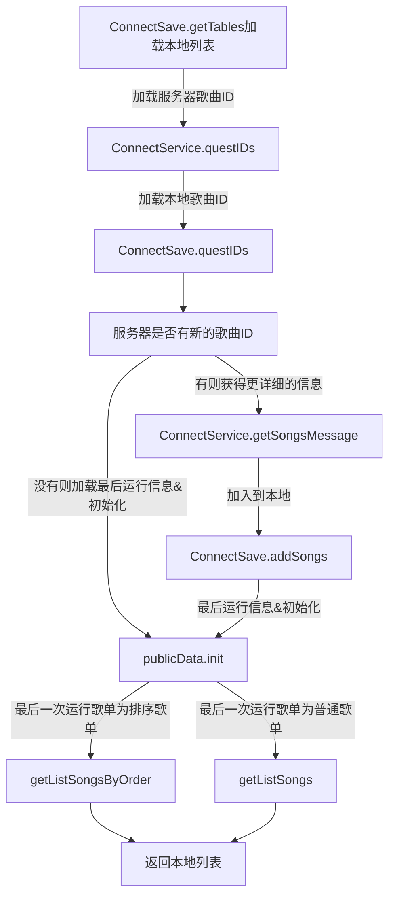
2、addSongList(String listName)
试添加一个歌单
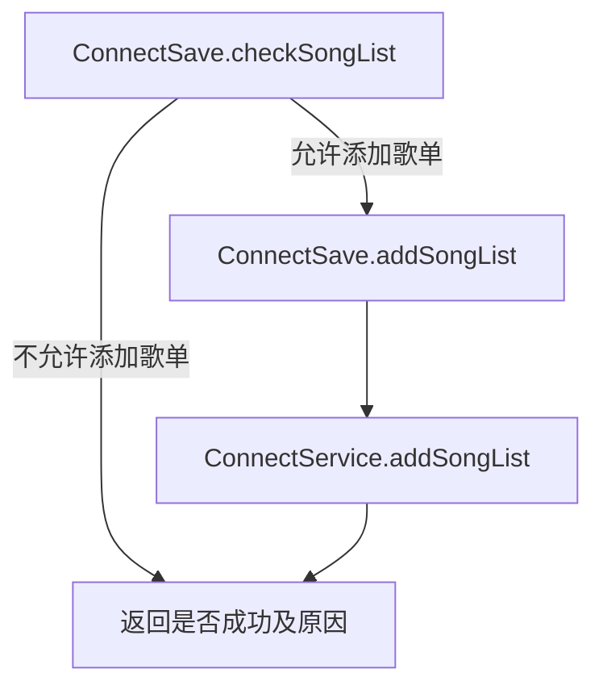
3、deleteSongListForShared
调用ConnectSave.delSongListForShared
4、deleteSongListForDataBase
调用ConnectService.delSongList和ConnectSave.delSongListForDataBase
5、getListSongs
调用ConnectSave.getListSongs
6、getListSongsByOrder
调用并返回ConnectSave.getListSongsByOrder(order)

8、downLoadSong
调用并返回ConnectService.questSong
9、saveDownloadPath
调用ConnectSave.saveDownloadPath
10、removeSongFromList
从歌单移除一首歌曲
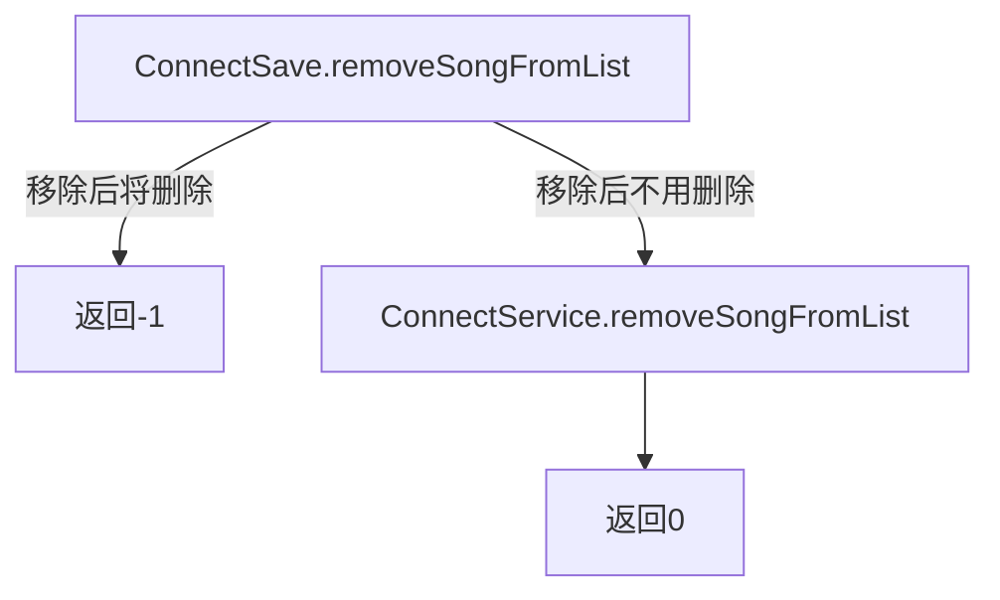
11、deleteSong
调用 ConnectSave.deleteSong和ConnectService.deleteSong
12、addSongInList
添加一首歌曲到歌单
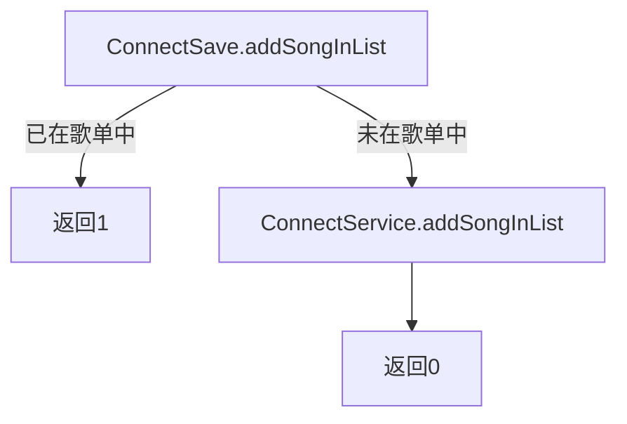
13、addTimes
调用ConnectSave.addTimes
#### connect_save.dart
1、init
初始化数据库，在MusicDatabase为null时使用，第一次运行时会新建数据库
2、getTables
查找本地的自定义歌单，返回一个List（不为null）
3、questIDs
请求所有歌曲ID，用来在初始化中服务器比较，返回所有歌曲ID构成的Set
4、addSongs
向本地数据库添加一个歌曲，每列信息都包含
只在数据库新增歌曲时使用
5、getListSongs
获取一个歌单所有歌曲的ID,MUSICNAME,ARTIST,PATH
只在切换/打开自定义歌单时使用，会将该歌单保存为最后打开的歌单
publicData.listMes也会改变
6、getListSongsByOrder
获取一个歌单所有歌曲的ID,MUSICNAME,ARTIST,PATH，并按Path的播放次数排序
只在切换/打开排序歌单时使用，会将该歌单保存为最后打开的歌单
publicData.listMes也会改变
返回排序结果的List用来在ListTile上显示
7、checkSongList
检查待添加的歌单名是否合法
合法时返回0，并且shared先进行更新
不合法时返回1或-1
8、addSongList
本地数据库添加歌单，该歌单已经在之前进行检查合法性了
9、delSongListForShared
从shared中删除一个歌单
10、delSongListForDataBase
从本地数据库中删除一个歌单
由于本地数据库不能直接删除列，所以要赋值数据表
鉴于该操作可能花费较长时间，前面更新shared是用来更新前端的
11、 saveDownloadPath
将歌曲的文件路径保存在数据库中
12、removeSongFromList
将歌曲移出歌单
若该歌单为歌曲的唯一歌单将会返回-1而不移除
否则将触发DelSingEvent
13、deleteSong
删除歌曲记录，若歌曲已经下载则删除文件
触发DelSingEvent
14、addSongInList
将歌曲添加到别的歌单中，若已存在则返回1
15、addTimes
更新歌曲的播放次数
#### connect_service.dart
1、questIDs
请求服务器所有歌曲ID，用来在初始化中和本地做比较
2、getSongsMessage
在服务器新增歌曲时使用
将返回该歌曲除了Data字段的所有信息
3、questSong
下载一首歌曲，返回它文件的保存路径
4、addSongList
服务器数据库新增歌单字段
5、delSongList
服务器数据库删除歌单字段
6、removeSongFromList
服务器数据库更改歌曲的歌单信息（移出歌单
7、deleteSong
服务器删除一首歌
8、addSongInList
服务器数据库更改歌曲的歌单信息（加入歌单
## 三、APP前端记录
#### main.dart
main函数里，先进行初始化，再设置强制竖屏，最后运行MyApp
MyApp：
home进入闪屏动画加载界面
navigatorKey 用来无context的页面管理
#### load_page.dart
一个闪屏动画的页面加载，也会进行App运行的数据读取
关键逻辑代码，约24~37
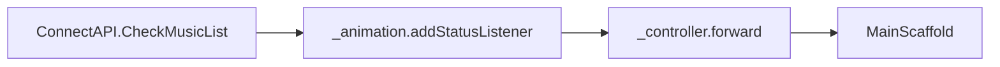
可优化部分：CheckMusicList应该和_animation.addStatusListener异步，使在播放的同时加载数据，减少等待时间
#### mainpage.dart
主界面，显示各种歌单
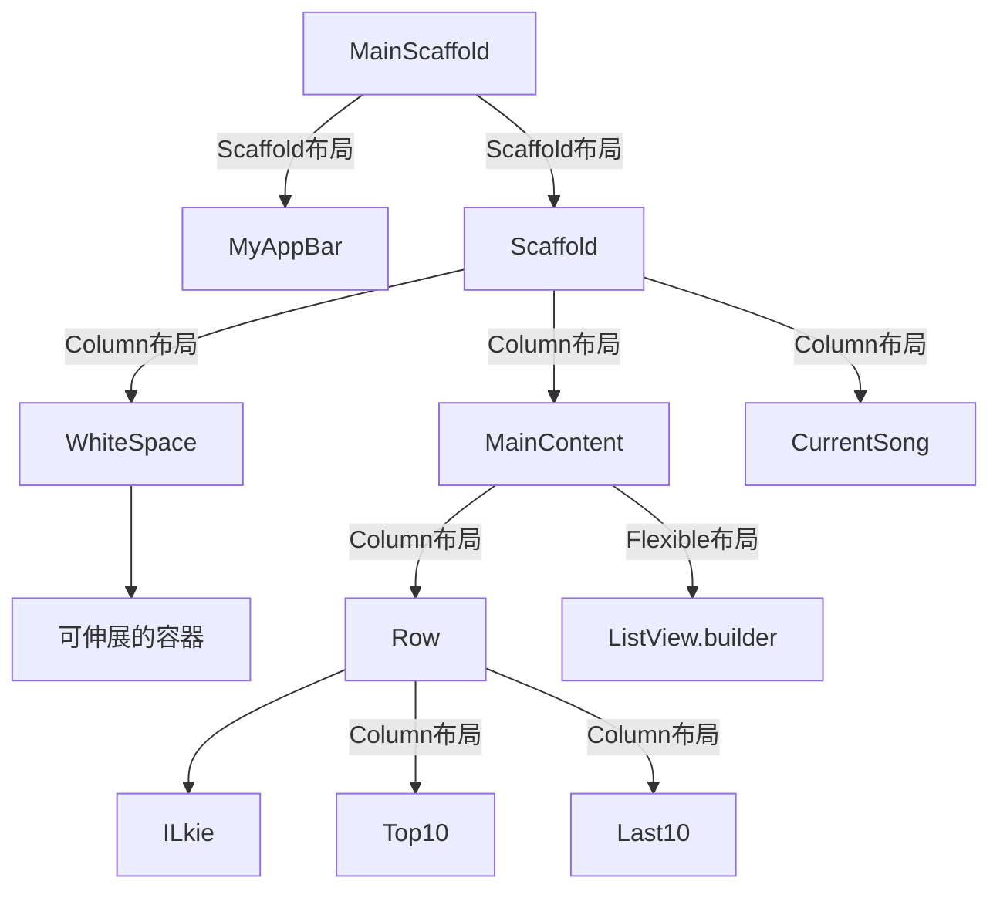
关键逻辑代码
57~91
_MainContentState.initState里
_delSingListEvent添加删除歌单事件
_addSingListEvent添加新增歌单事件(获得新增歌单的名字listName
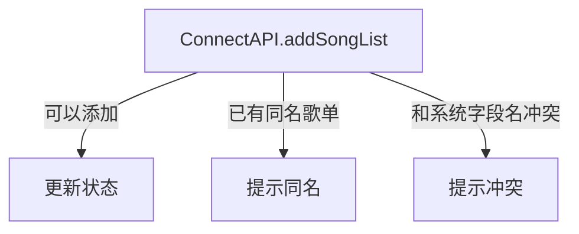
#### songlists_widget.dart
各种自定义歌单的样式
1、Top10&Last10
点击时用ConnectAPI.getListSongsByOrder返回的orderList生成SongListPage.order
2、NormalSingList
点击时用ConnectAPI.getListSongs，后台更新完毕后生成SongListPage
长按时弹出确认删除歌单界面，点击确认后将触发DelSingListEvent
3、ILkie
点击时用ConnectAPI.getListSongs，后台更新完毕后生成SongListPage
4、AddSing
点击时弹出添加歌单页面，点击确认后将触发AddSingListEvent
5、WithIconText
带文字和图标的按钮
#### songlist_page.dart
SongListPage
两种生成方式，一种是给Top10和Last10使用的
关键代码26~30
initState里添加DelSingEvent事件，更新状态
关键代码57~61
如果用.order生成列表，会使用OrderMusicTile
一般歌单则用MusicTile
#### songlist_tile.dart
1、MusicTile
一般的歌曲列表元素
点击时将loadMusic该元素所指向的音乐，由于不调用nextMusic需要手动将该音乐放入publicData.playedMusic
尾部图标被点击时
关键代码40~90
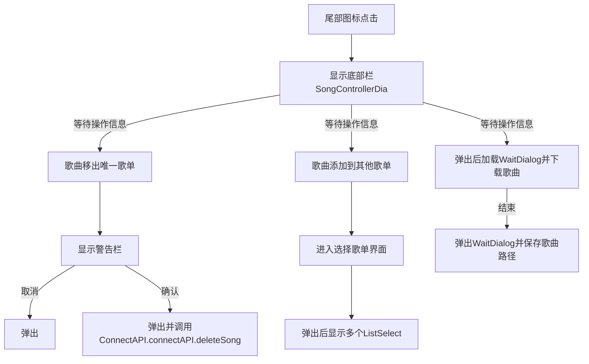
2、OrderMusicTile
逻辑代码和MusicTile相同
但没有移出歌单这些逻辑代码
3、ListSelect
待选择的歌单
关键代码112~118
点击时调用ConnectAPI.addSongInList
根据返回结果提示信息
#### songcontroller_dia.dart
SongControllerDia和OrderSongControllerDia
根据选择的ListTIle不同返回不同的结果
OrderSongControllerDia没有移出歌单这一个Tile
#### song_page.dart
歌曲播放界面
关键代码23~29
添加了ChangeSongEvent事件
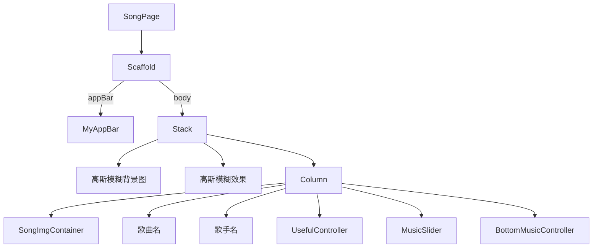
#### songpage_widget.dart
1、SongImgContainer
以后有机会改成显示字幕或图片
2、MusicSlider
音乐进度条
关键代码50~67
为Player.audioPlayer添加了两个事件，一个是歌曲长度（歌曲内容）改变时触发，一个是歌曲播放进度变化时触发，两者结合能算出音乐播放进度的百分比
关键代码80~90
当Slider的值被手动改变时触发方法，Slider值被设置为新的值，并且会让播放器跳转到指定位置播放
3、UsefulController
用来防止一些有用的按钮，现在只用来切换播放模式，不赘述
4、BottomMusicController
音乐播放控制器
关键代码142~152
为Player.audioPlayer添加了两个事件，一个是暂停时触发，一个是播放时触发，用来改变playOrPauseIcon内容
关键代码153~158 
初始化playOrPauseIcon内容
3个按钮的onTap也不再赘述
#### blur_filter.dart
模糊滤镜，可以调节模糊程度
#### circle_button.dart
由于较大的IconButton的点击范围误差严重，所以自己做了一个圆形按钮
点击事件自定义，点击时会改变颜色
#### comback_iconbutton.dart
用于在AppBar的左上角，点击后退出当前界面
#### current_song.dart
大多数页面底部的元素
用于控制播放器
3个按钮的逻辑代码和SongPage的相同，但由于publicData.publicMusicMessage可能未指向任何一首歌，所以此时不会有任何反应
关键代码88~101
点击CureentSong主体部分将跳转到SongPage,此时如果歌曲不为null应该算出播放的进度并传给SongPage，否则若在暂停状态下点击，Slider的值将为0
#### myappbar.dart
1、MyAppBar
自定义的AppBar
重要代码30~33
点击右边的放大镜将进入搜索页
2、SearhClass
自定义搜索栏，支持歌名大小写搜索（歌手搜索算了，反正也用不到
关键代码95~100
close(context,null)这段代码之前不能再有新的页面加入
其他代码和MusicTile被点击相同
#### wait_dialog.dart
WaitDialog能够使应用在任意页面弹出一个Dialog
但这个页面可能不支持本地化
没有什么逻辑代码，其下面的类也是为了支持WaitDialog的，从源码抄过来的，注释内容为修改部分
部分类原来的名字中不含Wait这几个字母

# 遇到的坑
新建FLutter项目运行不了，损坏
Error: ADB exited with exit code 1 Performing Streamed Install 重启模拟器/手机

当布局高度写死时，例如设置为屏幕高度，这时候键盘弹起页面上会出现布局overflow的提示
1）把Scaffold的resizeToAvoidBottomInset属性设置为false，这样在键盘弹出时将不会resize

2）把写死的高度改为 原高度 - MediaQuery.of(context).viewInsets.bottom，键盘弹出时布局将重建，而这个MediaQuery.of(context).viewInsets.bottom变量在键盘弹出前是0，键盘弹起后的就是键盘的高度

Sqlfite不能删除字段
php->fetchall遇到boolean会报错

current_song添加了一个ChangeSongEvent
mainpage添加了addlistEvent和del
Flutter有时热更新不会把一些代码上传上去但卸载重新安装一定会

还没做的是：SongPage按钮布局
Slider过高（value值）

生成APK报错build.gradle: Minimum supported Gradle version is 5.4.1. Current version is 4.10.1.
除了网上一般的建议 看https://blog.csdn.net/weixin_42863267/article/details/104611392

数据库操作时间大于dio connect时间的话会报连接超时错误而非等待结果超时错误

Flutter loading
如果关闭dart.exe和 lockfile文件后还是没解决
在之后控制台输入flutter doctor，此时可能会卡住，过一会点击关闭flutter doctor会正常运行
原因可能是和git冲突https://www.jianshu.com/p/898faadf1140

