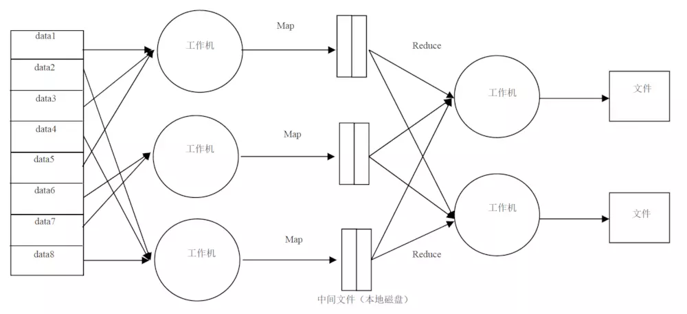

### 并行计算：

一次执行多个指令的算法。

分为**时间并行和空间并行**。时间上并行采用流水线技术，空间上并行多个处理器并发地执行计算。

也可分为**数据并行和任务并hh行**。数据并行将大的数据任务化解为若干个相同的子数据任务，比任务并行简单。例：3人批改有30道题目的300份试卷。数据并行：每人改100份，每份30题。任务并行：每人10道，改300份。

### 分布式计算：

将数据分成小块，由多台计算机分别计算，再上传计算结果，统一合并，得出数据结论。

较理想的处理模式：任务分为等大**数据块**（只是较理想的一种），将这些数据块以**多副本**（防止数据丢失）形式存储在计算机集群的不同机器上，每台计算机分但自己的**小任务**，计算完成将结果通过**Reduce过程**进行最终结果计算，输出结果。

| **相同点**                     | **不同点**                                                   |
| ------------------------------ | ------------------------------------------------------------ |
| 通过并行获得高性能，化大为小。 | 内存分配不同。并行计算，所有**处理器共享内存，内存让多个处理器彼此交互信息**；分布式计算，**处理器独享内存**，数据交换通过**处理器传递信息**完成。 |
|                                | 工作原理不同。并行程序并行处理的任务包之间联系紧密，每个任务包都必要，**计算结果相互影响**，要求每个计算结果**绝对正确**；分布式任务包之间**相互独立**，前一个任务包结果未返回或处理错误对下一个任务包处理几乎没什么影响。分布式**实时性要求不高，可容错**。 |

