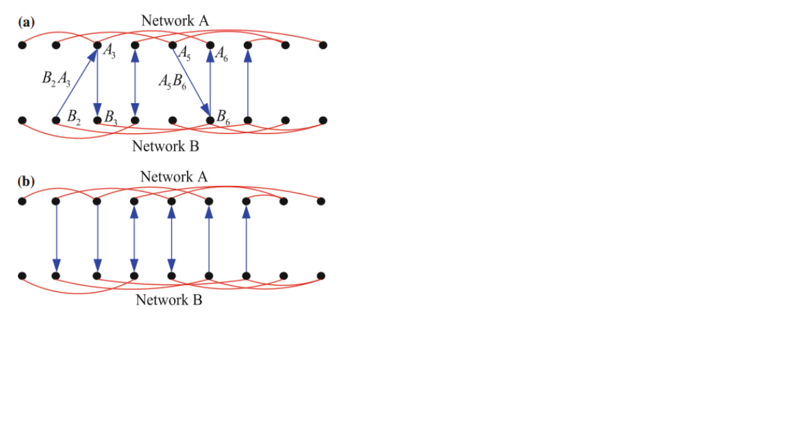

部分耦合的相互作用网络结构更具有现实意义性。在相互作用网络中存在部分顶点并不需要依赖其他网络的顶点而存在，这些顶点具有自治属性。随着自治顶点的数量增加达到某个阈值之上，相互作用网络的一阶渗流相变特性将转变为如同单一网络中经典的二阶连续的渗流相变特性。假设网络结构是由两个分别有 Na 和 Nb 个 顶点数的随机网络 A 与 B 构成。在网络 A 中，顶点根据度分布 P a(k) 随机添加连 边，而在网络 B 中则根据  P b(k) 随机添加连边。另外，网络 A 中有一部分顶点qa依 赖于网络 B 且网络B中有一部分顶点qb依赖网络 A，同时假设，任意一个网络中 的顶点的依赖顶点数不超过一个，且若顶点ai依赖顶点 bm，且 bm依赖顶点 ak，则 有*i* = *k* ，满足无反馈特性，下图展示了有反馈与无反馈依赖特性之间的区别。

(a).网络A中顶点 A3依赖于网络B中的 B2 ，网络B中另一个顶点 B3依赖于网络A中的 A3
(b).网络 A 与网络 B 中的顶点均最多只有一个依赖顶点，且不满足(a)中的依赖条件