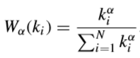
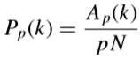
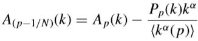
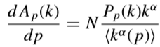
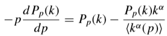
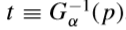
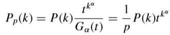
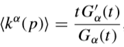
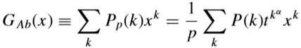

无标度网络在遭遇蓄意攻击时，网络表现出很强的脆弱性，而在遭遇随机攻击时，网络则表现出很强的鲁棒性。

 在随机性攻击方面，三种网络都表现出很强的鲁棒性；在蓄意性攻击方面，BA无标度网络和互联网都表现出了很强的脆弱性，但互联网稍好点，而WS小世界网络几乎没表现出脆弱性。

 τ为攻击标度，f取值区间为【O，1】，f=l时称为完全随机性攻击，即从所有节点中随机选择摧毁，f=0时称为完全确定性攻击，即针对性地攻击网络中度值最大的节点，_r=0．2即从度最高的20％的那部分节点中，随机选择进行摧毁。

Wα(ki) 被分配到每个节点，表示拥有ki条边的一个节点i被初始攻击时并且不活泼的概率

其函数族： , −∞<α<+∞.   (1) 

当α>0，度更高的节点对于蓄意攻击表现为更脆弱；度大节点优先被攻击

当α<0，度高的节点被保护，所以失效的概率更低。

当α =0, W0 = 1/N，代表随机移除节点；随机攻击模型

α →∞，代表蓄意攻击的情况，节点严格按照从度高的节点到度低的节点的顺序被移除；

对于α<0的情况，度为0的节点应该在分析开始前被移除。

α=0，对应于熟人免疫策略。

 

模型：A、B两个网络，节点数N相同，每个网络中的N个节点通过双向依赖链路连接到另一个网络中的节点，从而建立一对一的对应关系。A中节点的功能依赖与B中与之对应的节点，反之亦然。

在每个网络中，节点以度分布分别为PA(k) 和 PB(k) 随机相连。

 

攻击过程：只有网络A被攻击。我们首先从网络A中移除一部分节点，用概率Wα选择（1-p）比例的节点，并且删除所有与被移除节点相连的边。当节点和边被按顺序移除，网络A开始分裂成连通分量，未连接到最大分量的节点被视为非活动节点并被移除。

由于网络间的依赖性，网络B中连接到网络A中已删除节点的所有节点也将被删除。网络B也开始分裂成连通分量，并且只有在巨大分量中的节点被保留。

网络B又把这种破坏传回网络A，这种破坏在网络A B 间来回地传播，直到它们完全分裂或到达一个相互连接的巨大分量，并且不再发生节点和链接的进一步移除。

 

研究方法：找到一个等效的网络A' ，使得相互依存网络A和B上的目标攻击问题可以当作相互依存网络A' 和B上的随机攻击问题来解决。首先，根据公式（1），在去除（1-p）比例的节点后，我们得到了网络A中剩余节点的度分布Pp（k），但保留了导致移除的节点的剩余节点的边。设Ap（k）为度为k的节点的数量。

   （2）

当另一个节点被移除，Ap（k）变为：

   （3）   

在N→∞的范围内，式（3）可以用Ap（k）对p的导数表示：

    (4)

利用（4）求（2）对p的导：

   （5）  这对于N→∞是准确的。

为了解（5），定义一个函数：  

一个新的变量：     逆函数

通过直接微分，以下两个公式满足（5）：

   （6） P(k)怎么来的

   （7）

因此Pp（k）的生成函数是：   （8）

